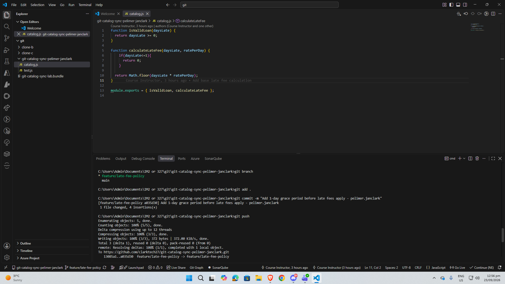
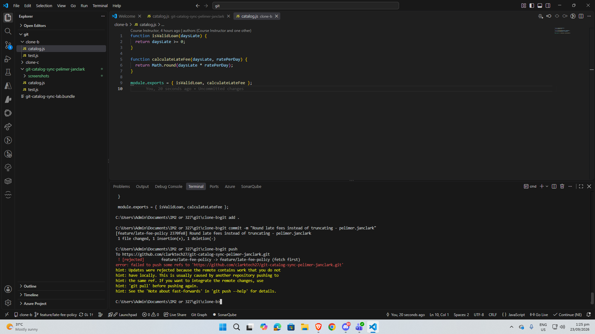
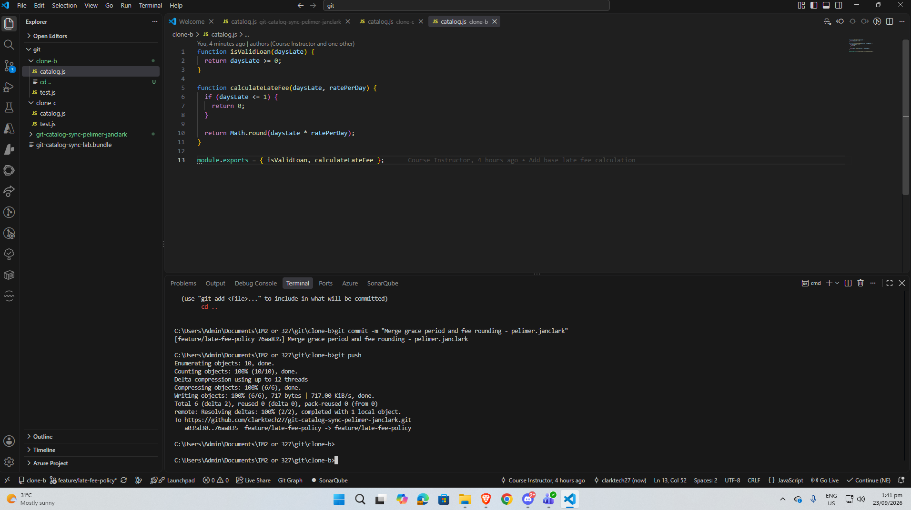
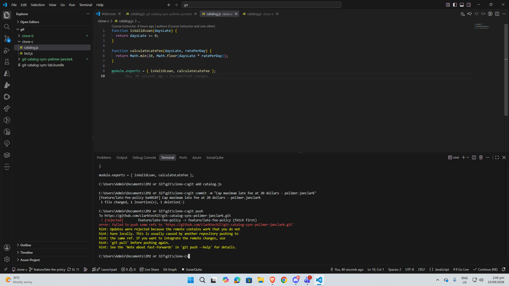
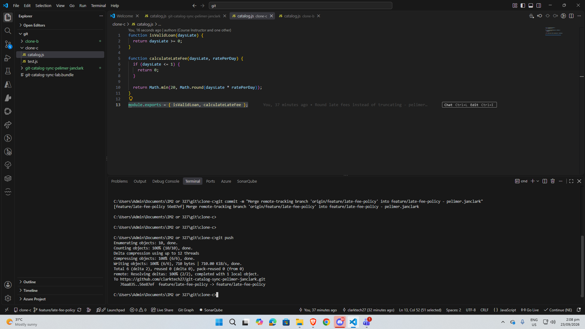
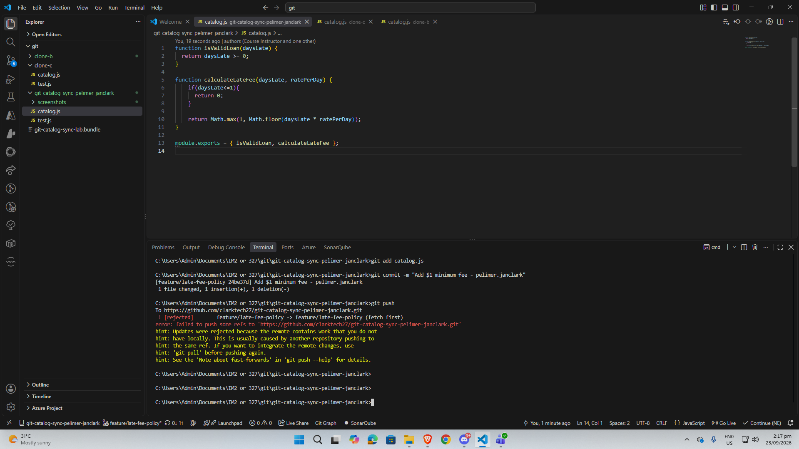
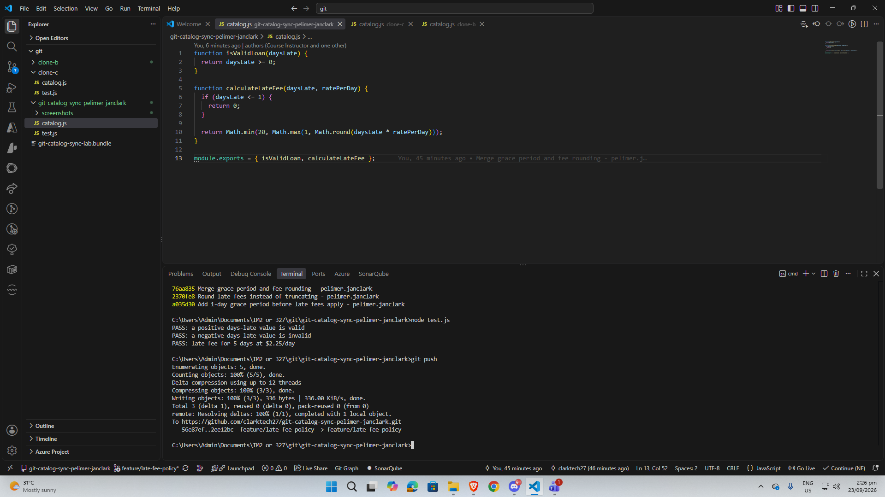
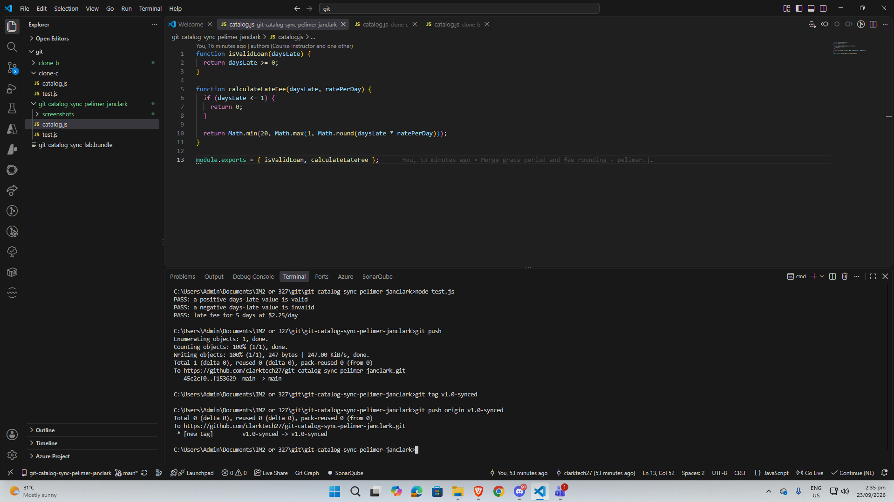

## Questions

**1. Walk through the final `calculateLateFee` function and name which contributor's change is responsible for each part.**
    function calculateLateFee(daysLate, ratePerDay) {
  if (daysLate <= 1) {
    return 0;
  }
  return Math.min(20, Math.max(1, Math.round(daysLate * ratePerDay)));
}
    * if (daysLate <= 1) return 0; — Clone A's grace period (Task 1)
    * Math.round(daysLate * ratePerDay) — Clone B's rounding fix, replacing the original truncation (Task 2/3)
    * Math.max(1, ...) — Clone A's $1 minimum fee (Task 6)
    * Math.min(20, ...) — Clone C's $20 maximum cap (Task 4/5)

**2. Compare Task 3's two-way conflict to Task 5's three-way conflict — what got harder with a third line of work?**
      Task 3 was a straightforward choice between two visible changes grace period vs. rounding. Task 5's conflict combined two sides that were each already merged histories, so the markers didn't clearly show three separate contributions. I had to remember what each one was supposed to do and recombine them correctly. Getting the order right (round, then floor to $1, then cap at $20) mattered more, since a wrong order could quietly break one behavior without causing an actual Git conflict.
     

**3. What's the actual difference between how you resolved Task 5 (merge) and Task 6 (rebase)?**
        The merge in Task 5 created a real merge commit with two parents, so the log still shows both branches coming together  true, slightly messy order things happened in. The rebase in Task 6 didn't create a merge commit at all, git replayed my $1-minimum commit on top of the latest history with a new hash, producing a clean, linear log with no visible branching, even though the work was actually done in parallel.

**4. If this were a real team of three, what one process change would have prevented all three rejected pushes?**
       Requiring everyone to fetch/pull right before starting new work, not just before pushing. All three rejections happened because someone began editing a local copy that was already stale, unaware the branch had moved.

# Workflow Log — Catalog Sync Lab

## Task 1: Push change from Clone A

          
## Task 2: Diverge from Clone B — rejected

## Task 3: Reconcile with a merge

## Task 4: Bring in third contributor — rejected

## Task 5: Three-way merge

## Task 6: Diverge a third time — rebase

## Task 6: Diverge a third time — rebase

## Task 7: Merge into main, tag, push

---

